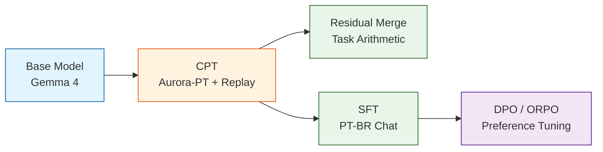

# 🇧🇷 Adapting Gemma 4 to Brazilian Portuguese

> **Production-grade pipeline for computationally adapting Google Gemma 4 to Portuguese (pt-BR) via the Aurora-PT corpus (331B tokens).**

[](https://www.python.org/downloads/)
[](https://www.apache.org/licenses/LICENSE-2.0)
[](https://huggingface.co/)

---

## 📋 Scientific Overview

This repository implements a rigorous **five-stage adaptation pipeline** intended to produce state-of-the-art results for Brazilian Portuguese, moving beyond simple instruction-tuning to proper language adaptation. 

Our strategy strictly separates **Language Adaptation (CPT)** from **Instruction Alignment (SFT/DPO)**, preventing the catastrophic forgetting often seen when continuously pretraining on instruction-tuned models.



### 🔬 Core Methodology & Golden Rules
1. **The Golden Rule**: Aurora-PT is an unstructured corpus and is **never** used inside an `SFTTrainer`. It is processed strictly via `CausalLM` next-token prediction with packed sequences.
2. **Replay Mix Strategy**: To preserve emergent downstream capabilities and coding skills, our CPT stage utilizes probabilistic dataset interleaving. We mix Portuguese (Aurora-PT) with high-quality English (e.g., FineWeb-Edu) and optional Code (e.g., StarCoder).
3. **LoRA Safety Validation**: Gemma 4 utilizes `Gemma4ClippableLinear` in its vision and audio towers. We explicitly restrict our LoRA `target_modules` to language projections to prevent architectural crashes.
4. **Think Mode Isolation**: Evaluations are strictly isolated. We run all benchmarks in both `think_on` and `think_off` parametric modes to decouple native language improvements from chain-of-thought reasoning artifacts.
5. **Multi-tier Decontamination**: We run MinHash LSH and Exact/Normalized overlap checks against all benchmark datasets prior to training to ensure clean data validation.

---

## 🚀 Quick Start

```bash
# 1. Clone & Install
git clone https://github.com/vfcarida/Adapting-Gemma-4-to-Brazilian-Portuguese
cd Adapting-Gemma-4-to-Brazilian-Portuguese
pip install -e ".[dev]"

# 2. Validate environment
gemma4pt preflight

# 3. Run tests
pytest tests/ -q

# 4. End-to-end Smoke test (CPU)
gemma4pt smoke

# 5. Train (when GPU is available)
gemma4pt train-cpt configs/train/cpt_pilot.yaml
```

## 🛠️ CLI (`gemma4pt`)

The project now includes a powerful CLI to manage the entire pipeline:
```bash
gemma4pt preflight          # Valida ambiente
gemma4pt smoke              # Smoke test E2E
gemma4pt data-validate      # Valida dados
gemma4pt contamination-check # Verifica contaminação
gemma4pt tokenizer-audit    # Fertilidade tokenizer
gemma4pt train-cpt CONFIG   # Continued Pretraining
gemma4pt train-sft CONFIG   # SFT
gemma4pt merge              # Residual merge
gemma4pt eval               # Avaliação benchmarks
gemma4pt report             # Gera relatórios
gemma4pt manifest           # Manifesto reprodutibilidade
gemma4pt run-all            # Pipeline completo
```
*(All operations support `--dry-run`, `--tiny`, and `--cpu-only` flags).*

## 📚 Documentation

Deep operational guides are located in the `docs/` folder:
| Document | Content |
|----------|---------|
| `docs/GEMMA4_COMPLIANCE.md` | Conformidade Gemma 4, thinking, multi-turn |
| `docs/TRAIN_READY.md` | Checklist de prontidão para treino |
| `docs/EVAL_PROTOCOL.md` | Protocolo de avaliação, métricas, CI |
| `docs/SMOKE_TESTS.md` | Smoke tests e validação |
| `docs/EXPERIMENT_PLAN.md` | Plano experimental 11 passos |
| `docs/ARCHITECTURE.md` | Design do sistema |
| `docs/DATA_PIPELINE.md` | Pipeline de dados |
| `docs/TRAINING_GUIDE.md` | Guia de treinamento |

---

## 📊 Evaluation Benchmarks

We utilize a layered evaluation suite to prevent saturation on easy or highly-translated English benchmarks. All models are evaluated generatively (`temperature=0.0`).

| Benchmark | Domain | Metric | 
|-----------|--------|--------|
| **ENEM** | Education (National Exam) | Approval Rate |
| **BluEx** | Education (University Entrance) | Approval Rate |
| **OAB-Bench** | Legal (Bar Exam) | Approval Rate |
| **ASSIN2-RTE** | NLI (Textual Entailment) | macro-F1 |
| **ASSIN2-STS** | Semantic Similarity | Pearson r / Spearman ρ |
| **HateBR** | Hate Speech Detection | macro-F1 |
| **TweetSentBR** | Sentiment Analysis | macro-F1 |
| **COPA-PT** | Causal Reasoning | Accuracy |
| **BRoverbs** | Cultural (Proverb Completion) | Accuracy |
| **MRPC-PT** | Paraphrase Detection | macro-F1 |
| **RTE-PT** | Textual Entailment | Accuracy |
| **DoNotAnswer-PT** | Safety / Refusal | Refusal Rate |
| **TugueSICE-PT** | Language Understanding | Accuracy |
| **XLSum-PT** | Long-context Summarization | ROUGE (opt) / Gen |

---

## 📁 Repository Architecture

```
.
├── ablations/                 # Automated hypothesis test outputs
├── configs/                   # YAML configurations for CPT, SFT, DPO, Merge, Eval
├── src/                       # CLI, Preflight, Data, Train, Eval, Utils
├── docs/                      # Extensive operational guides
├── tests/                     # 198+ Unit, integration, smoke, and golden tests
├── scripts/                   # Legacy end-to-end bash execution scripts
└── reports/                   # Markdown generation (summary.md, findings_for_paper.md)
```
## 📝 Requirements
- Python ≥ 3.10
- HuggingFace account with access to `google/gemma-4` variants and `Itau-Unibanco/Aurora-PT`.

## 📜 License
Apache 2.0
