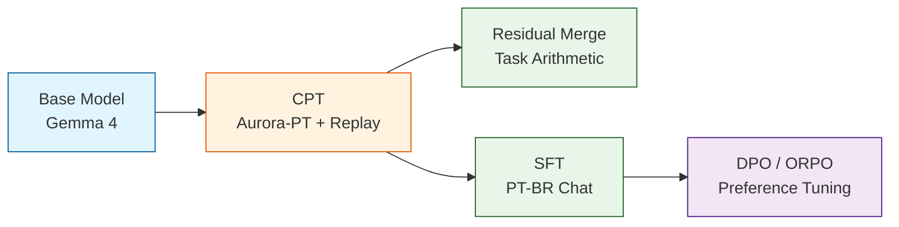

# 🇧🇷 Adapting Gemma 4 to Brazilian Portuguese

> **Production-grade pipeline for computationally adapting Google Gemma 4 to Portuguese (pt-BR) via the Aurora-PT corpus (331B tokens).**

[](https://www.python.org/downloads/)
[](https://www.apache.org/licenses/LICENSE-2.0)
[](https://huggingface.co/)

---

## 📋 Scientific Overview

This repository implements a rigorous **five-stage adaptation pipeline** intended to produce state-of-the-art results for Brazilian Portuguese, moving beyond simple instruction-tuning to proper language adaptation. 

Our strategy strictly separates **Language Adaptation (CPT)** from **Instruction Alignment (SFT/DPO)**, preventing the catastrophic forgetting often seen when continuously pretraining on instruction-tuned models.



### 🔬 Core Methodology & Golden Rules
1. **The Golden Rule**: Aurora-PT is an unstructured corpus and is **never** used inside an `SFTTrainer`. It is processed strictly via `CausalLM` next-token prediction with packed sequences.
2. **Replay Mix Strategy**: To preserve emergent downstream capabilities and coding skills, our CPT stage utilizes probabilistic dataset interleaving. We mix Portuguese (Aurora-PT) with high-quality English (e.g., FineWeb-Edu) and optional Code (e.g., StarCoder).
3. **LoRA Safety Validation**: Gemma 4 utilizes `Gemma4ClippableLinear` in its vision and audio towers. We explicitly restrict our LoRA `target_modules` to language projections to prevent architectural crashes.
4. **Think Mode Isolation**: Evaluations are strictly isolated. We run all benchmarks in both `think_on` and `think_off` parametric modes to decouple native language improvements from chain-of-thought reasoning artifacts.
5. **Multi-tier Decontamination**: We run MinHash LSH and Exact/Normalized overlap checks against all benchmark datasets prior to training to ensure clean data validation.

---

## 🚀 Quick Start

### 1. Environment Setup

```bash
# Clone the repository
git clone https://github.com/vfcarida/Adapting-Gemma-4-to-Brazilian-Portuguese
cd Adapting-Gemma-4-to-Brazilian-Portuguese

# Install dependencies
make install

# Configure credentials
cp .env.example .env
# Edit .env with your HF_TOKEN (Required for Gemma 4 & Aurora-PT) and WANDB_API_KEY
```

### 2. Data Quality & Contamination Audits (Stage 1)

```bash
# Tokenizer fertility analysis (tokens/char, tokens/word efficiency)
bash scripts/run_tokenizer_audit.sh

# Three-tier contamination check (Exact + Normalized + MinHash) against 14 benchmarks
bash scripts/run_contamination_checks.sh
```

### 3. Training & Automated Ablations

Our pipeline features an automated ablation orchestrator to systematically test our hypotheses:
- **Ablation B:** Base + CPT (Pure Aurora)
- **Ablation C:** Base + CPT + EN Replay
- **Ablation D:** CPT + Residual Merge
- **Ablation E:** CPT + SFT PT-BR
- **Ablation F:** CPT + SFT Mixed

```bash
# Run the automated ablation matrix
bash scripts/run_ablations.sh

# Alternatively, run the main CPT pipeline on Gemma-4-26B-A4B (Multi-GPU + DeepSpeed)
bash scripts/run_cpt_main.sh

# Run DPO Preference Tuning
python -m src.train.dpo_trainer --config configs/dpo.yml
```

### 4. Comprehensive Evaluation

```bash
# Evaluate all models on 14 PT-BR benchmarks
bash scripts/run_eval.sh
```
This generates two key artifacts in `reports/`:
- `summary.md`: Performance tables and Cost vs Quality analysis.
- `findings_for_paper.md`: Explicit analysis of hypotheses (e.g., Catastrophic Forgetting, Merge vs SFT) intended for direct inclusion in academic papers.

---

## 📊 Evaluation Benchmarks

We utilize a layered evaluation suite to prevent saturation on easy or highly-translated English benchmarks. All models are evaluated generatively (`temperature=0.0`).

| Benchmark | Domain | Metric | 
|-----------|--------|--------|
| **ENEM** | Education (National Exam) | Approval Rate |
| **BluEx** | Education (University Entrance) | Approval Rate |
| **OAB-Bench** | Legal (Bar Exam) | Approval Rate |
| **ASSIN2-RTE** | NLI (Textual Entailment) | macro-F1 |
| **ASSIN2-STS** | Semantic Similarity | Pearson r / Spearman ρ |
| **HateBR** | Hate Speech Detection | macro-F1 |
| **TweetSentBR** | Sentiment Analysis | macro-F1 |
| **COPA-PT** | Causal Reasoning | Accuracy |
| **BRoverbs** | Cultural (Proverb Completion) | Accuracy |
| **MRPC-PT** | Paraphrase Detection | macro-F1 |
| **RTE-PT** | Textual Entailment | Accuracy |
| **DoNotAnswer-PT** | Safety / Refusal | Refusal Rate |
| **TugueSICE-PT** | Language Understanding | Accuracy |
| **XLSum-PT** | Long-context Summarization | ROUGE (opt) / Gen |

---

## 📁 Repository Architecture

```
.
├── ablations/                 # Automated hypothesis test outputs
├── configs/                   # YAML configurations for CPT, SFT, DPO, Merge, Eval
├── src/
│   ├── data/                  # Streaming loaders, Replay mix (PT/EN/Code), Decontamination
│   ├── train/                 # CPT (CausalLM), SFTTrainer, DPOTrainer, Task Arithmetic
│   ├── eval/                  # Benchmark Runner, Prompt Templates, Bootstrap CIs, Metrics
│   └── eval/tasks/            # 14 distinct PT-BR evaluation task definitions
├── scripts/                   # End-to-end bash execution scripts
└── reports/                   # Markdown generation (summary.md, findings_for_paper.md)
```

## 📝 Requirements
- Python ≥ 3.10
- HuggingFace account with access to `google/gemma-4` variants and `Itau-Unibanco/Aurora-PT`.

## 📜 License
Apache 2.0
